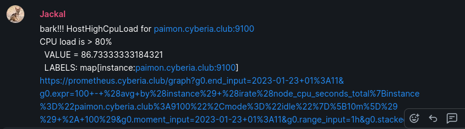
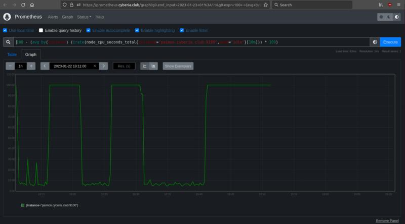

# 🐶 jackal


a humble doggy roboto

## what is jackal?

jackal is a watchdog - it polls for [prometheus alerts](https://prometheus.io/docs/prometheus/latest/querying/api/#rules) & barks in a matrix channel
to alert people of alerts that are firing. Then it humbly waits 24hours in order to help prevent alert fatigue 😌

jackal can automatically modify the promql query that drives the alert into a link to a prometheus graph which cleanly shows the metric which triggered the alert:






## usage

first, set up proper variables for jackal:

```
# use whatever user you want! can even be from different homeserver
# token can be found in element at settings -> help -> advanced -> token
# room IDs can be found under settings -> advanced -> internal room id
export JACKAL_MATRIX_URL="https://matrix.example.com"
export JACKAL_MATRIX_USER="@yourbot:example.com"
export JACKAL_MATRIX_TOKEN="yourbots-token"
export JACKAL_MATRIX_ROOM="!WAoLCYOOyceAxMaFYU:example.com"
export JACKAL_PROMETHEUS_URL="https://prometheus.example.com"
```

then, start the bot:

```
go run main.go
```
